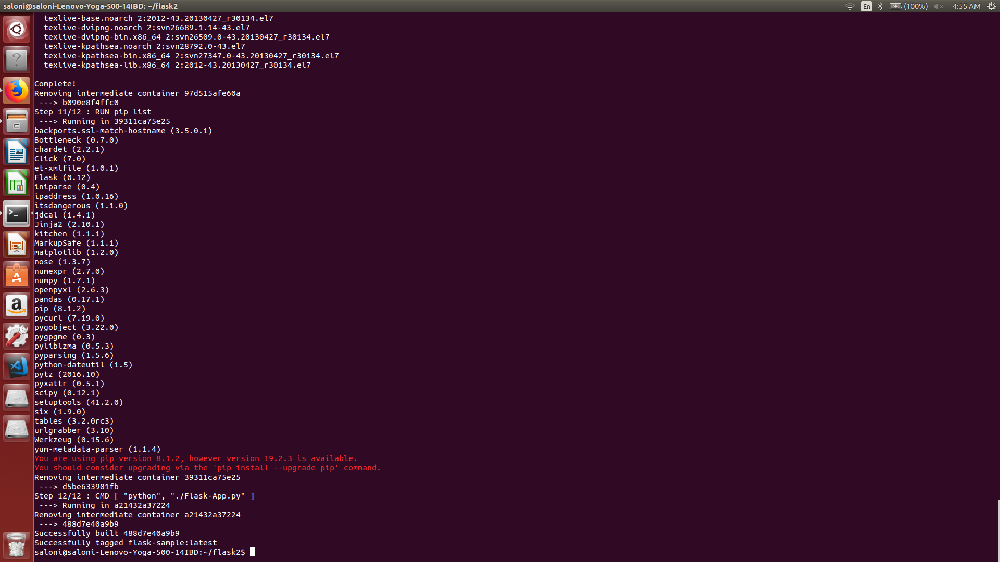
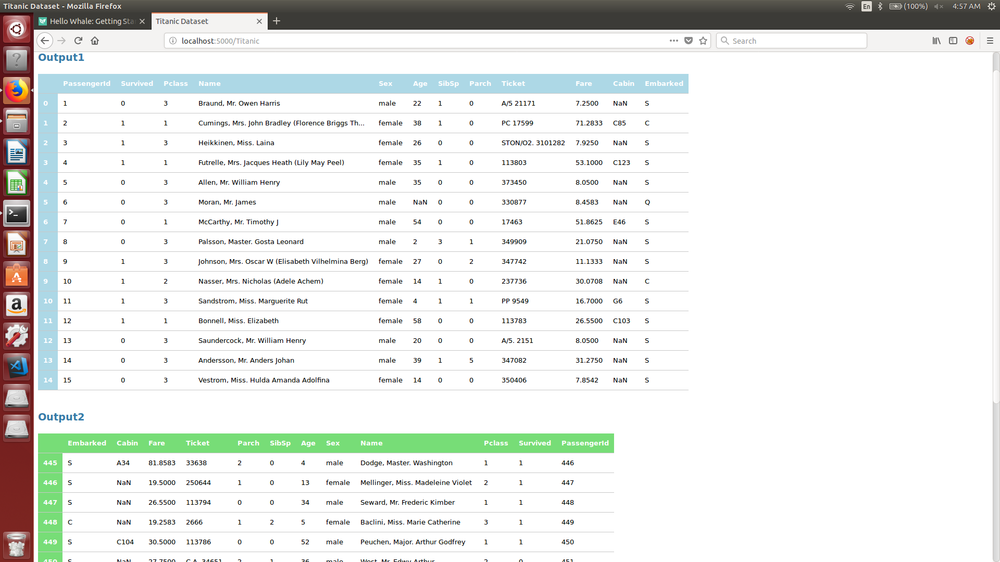
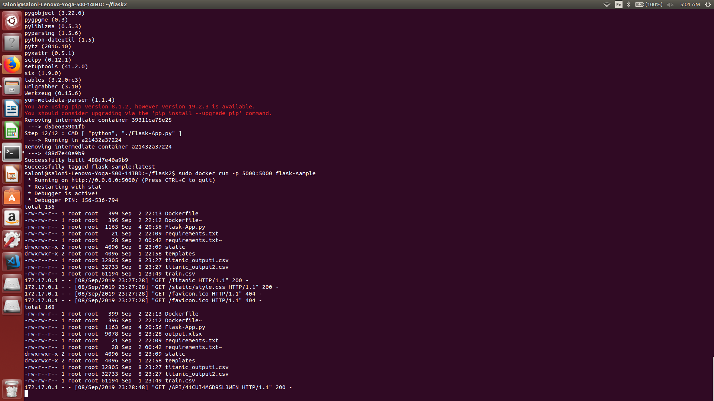

# Challenge 2 : Docker

1. Created a flask app with parent directory flask2.

2. The folder also contains the requirement.txt file which specifies the software that needs to be installed inside the container.

3. Created a Dockerfile that created the image.

4. The image was buit using the docker build command.

5. The container was deployed using the docker run command with port 5000.

Results:

Figure1: Commands for docker.

Figure2: Flask App in browser.

Figure3: Flask App in browser.

Figure4: Docker container

