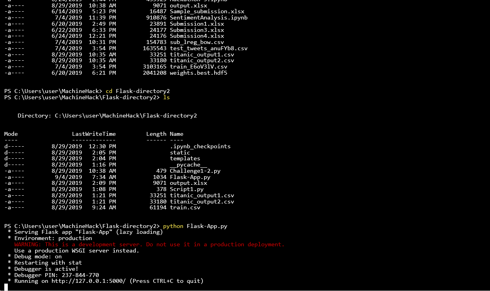
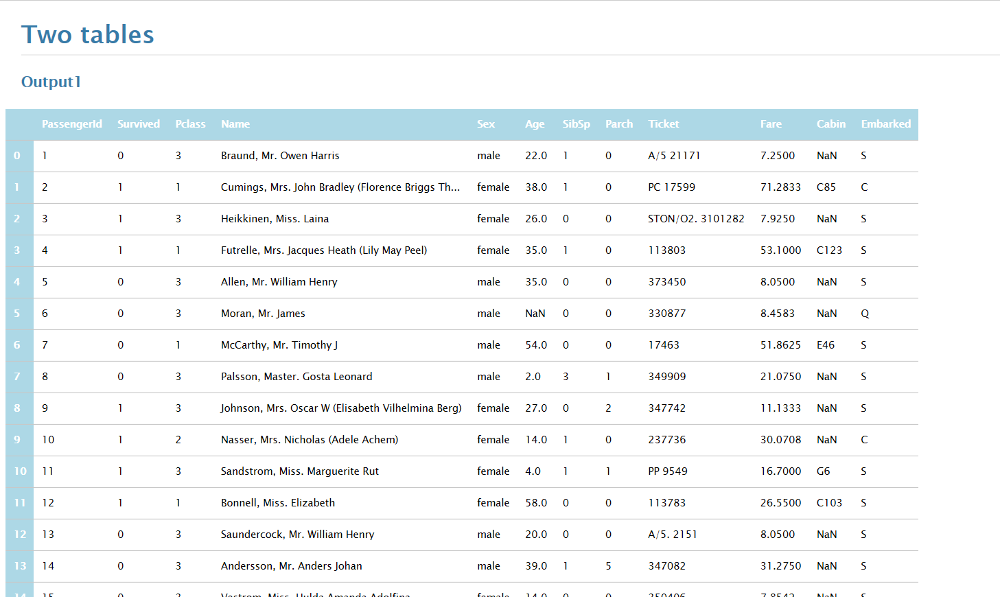
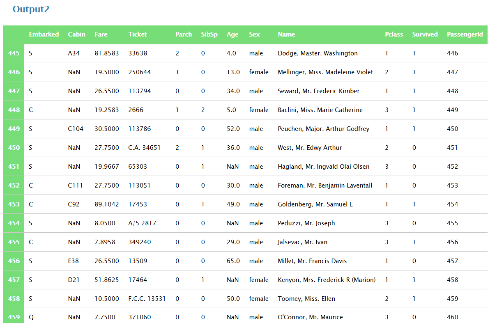
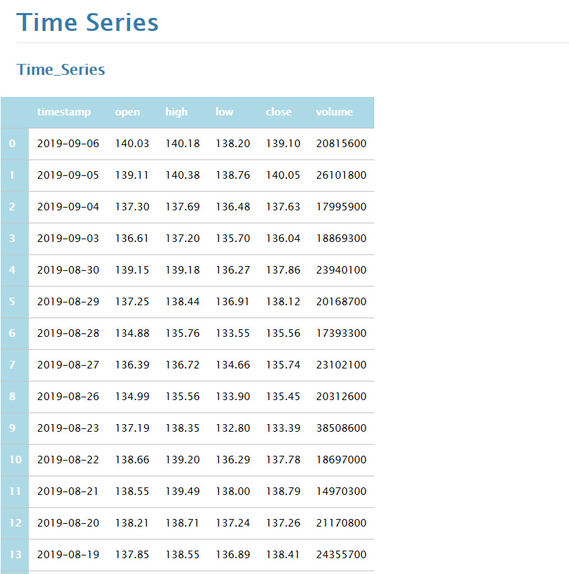

# Challenge1

This task creates a flask app that has two routes defined:

1. First route (/Titanic): The function associated with this route reads the titanic dataset to a dataframe.The first half is stored in the first output(csv) file. The columns in the second half are reversed and stored in the second output file.It returns the template to be displayed in the user's browser. The template displays the first 20 rows of the two halfs of the dataset in the user's browser. 

2. Second route(/API/apikey): The function associated with this route reads the reads in data using an API call.The api call is the the time series daily which takes the function(time_series_daily), symbol(MSFT), datatype(csv) and apikey as parameters.The dataframe is stored in an excel file as output. The function takes the apikey as an input and retuns the template to be rendered in the user's browser. The template displays the first 20 rows of the time series dataset in the browser. 
  
## Results

Figure 1: Structure of the Flask App

Figure 2: Few rows of first half of the titanic datset displayed in the browser. 

Figure 3: Few rows of second half of the titanic datset displayed in the browser. The columns have been reversed.

Figure 4: Few rows of the daily time series dataset from Alpha Vantage. 
