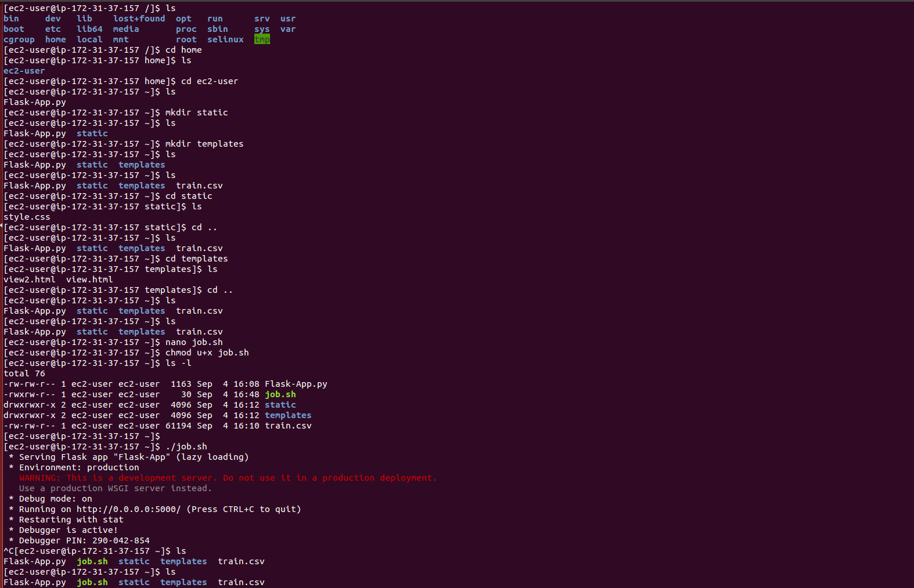
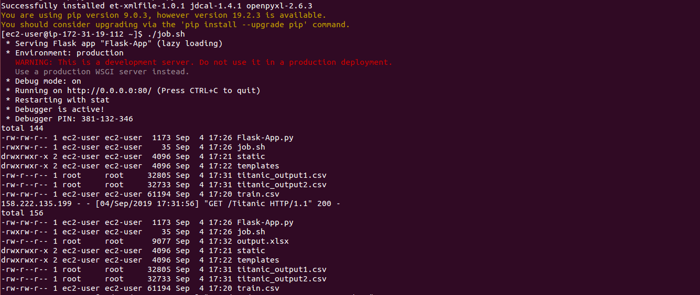
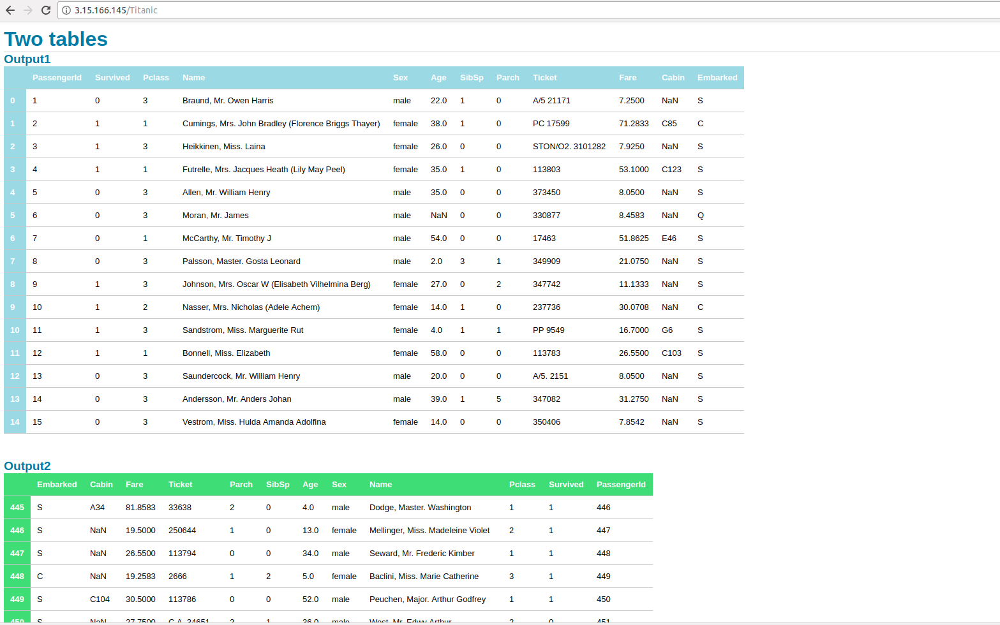

# Challenge 3: AWS

Steps:

1. Selected an EC2 service from the AWS Console and lauched an instance.

2. Used a Linux AMI and a t2.micro instance type.

3. Created a new key pair to connect remotely.

4. Configured security groups to add a HTTP rule and launched the instance. 

5. Connected to the EC2 instance from terminal using shh and the private key downloaded from console.

6. Used scp to transfer the all files(python, html, css, etc) for the Flask application.

7. Created a shell script to run the python file.

8. Once the flask app is deployed it can be viewed on IPv4 Public IP of the EC2 instance as IP:port/route.

Results:

Figure1: Running app in ec2 instance.

Figure2: Running app in ec2 instance.

Figure3: App running in browser

