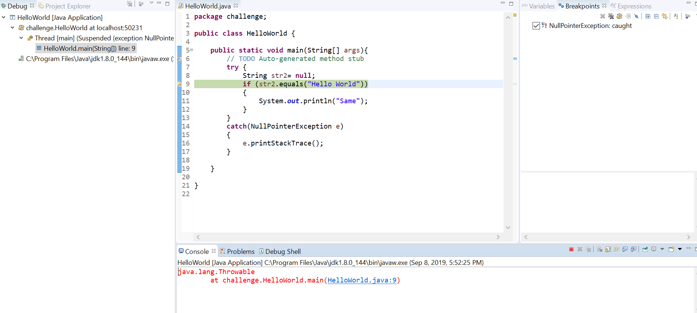

# Challenge 4 : Java

Created a Java application, added a Null Pointer exception breakpoint and displayed the stack trace. The null pointer exception is caught using a try and catch clause. In debug mode this caught exception suspends the thread and prints the stack trace. 

Figure 1: The java application with a breakpoint. 
