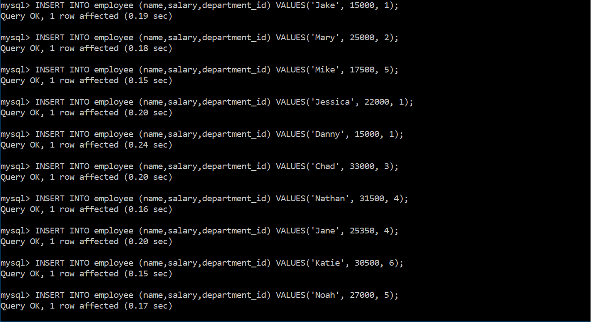
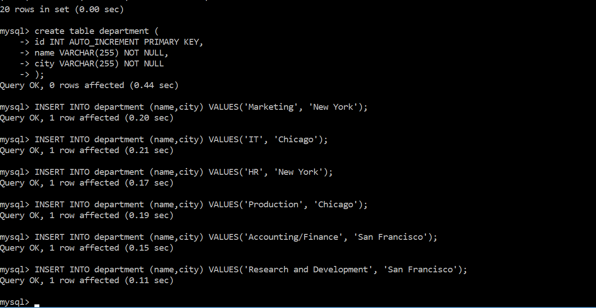
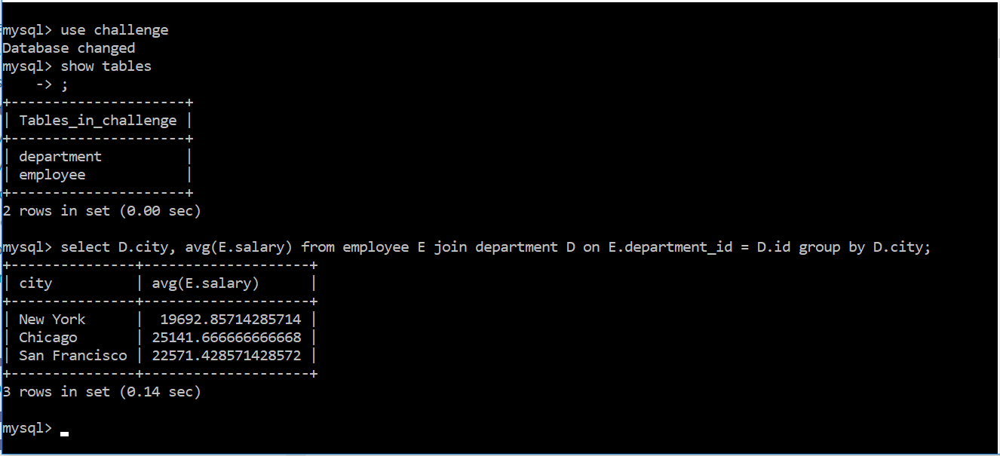

# Challenge 5: MySQL

1. Display the average salary per city.
2. Display the current date and time.

Queries :

Figure 1: Created a new database challenge. Created a new table employee with columns id(primary key), name, salary and department_id. 

Figure 2: Inserted rows into employee table.

Figure 3: Employee table

Figure 4: Created table department in challenge database. Columns in the table are id, name and city.

Figure 5: Displayed the average salary per city using the Department and Employee table.

Figure 6: Displayed the current date and time
